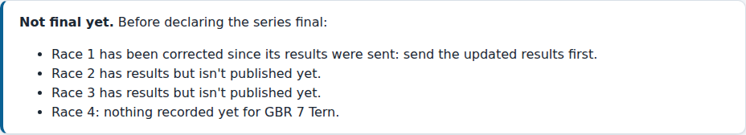
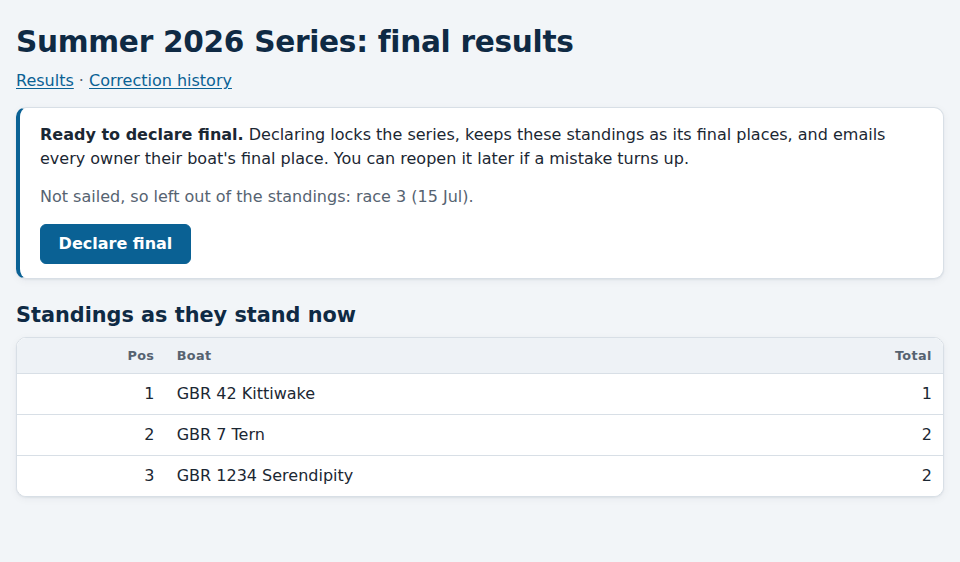
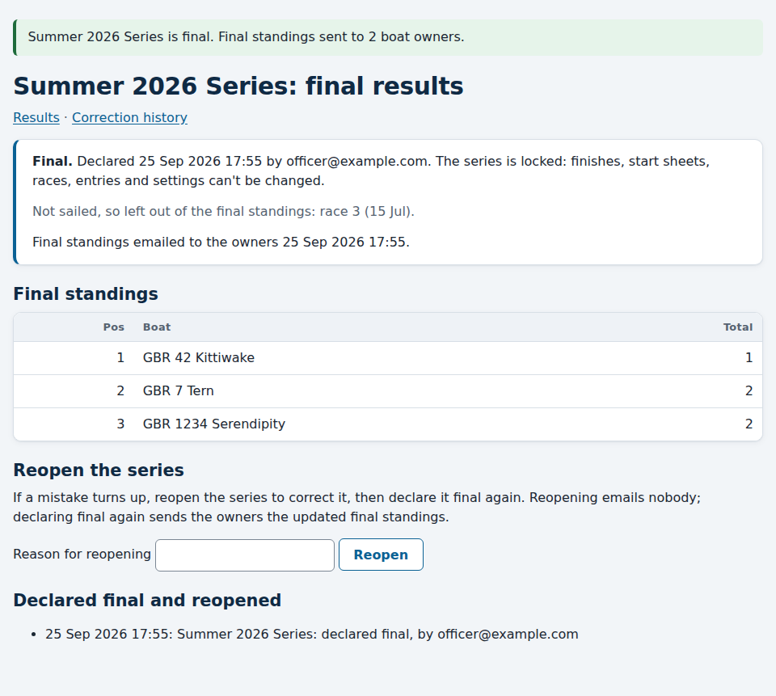

# Ending a series: final results

*For the race committee and the administrator.*

When a series is over, you **declare it final**. Its standings become the
final places, it is labelled **Final** on the results pages, and every owner
is emailed their boat's final place. A final series is locked: nothing in it
can change unless you reopen it.

## Before you start

Open the series' **Final results** page: on the series' results page, follow
**Final results** near the top. You can also go from the series in the
admin, where the **History** row has a **Final results** link.

The box at the top says whether the series is ready. A series can't be
declared final while any race:

- has results that aren't [published](publishing-results.md) yet;
- has been corrected since its results were sent. Send the updated results
  first;
- has a boat on its [start sheet](race-day.md) with nothing recorded.

The box names each race and boat, so you know what to do.

Races with nothing recorded, such as one cancelled for weather, don't stop
you. They are listed as "not sailed", and they aren't part of the
standings.

## Declaring the series final

When the series is ready, the page shows the standings as they stand, and a
**Declare final** button.

Press **Declare final**. Then:

- The series is **locked**. Finishes, start sheets, races, entries, the
  series' scoring settings and publishing are all refused, with the message
  "This series is final. Reopen it to make changes." The race day pages show
  the series is final, with no buttons.
- Every owner of a boat in the series gets a **Final standings** email, with
  the standings and their boat's place. As with results, only owners with an
  account on the site get it. If sending fails, the page says so and offers
  **Send final standings** to try again.
- The results pages label the series **Final**, and say when it was
  declared.

You can still rename the series, and change boats' details, including
their base numbers. A final series keeps its results exactly as they were
when you declared it, even if a boat's base number is corrected later for
another series.

## Reopening a series

If a mistake turns up after declaring, type a reason under **Reopen the
series** and press **Reopen**. The reason goes in the series' history. The
series is then unlocked, and its results are recalculated from the finishes
again, so you can correct it as usual.

Reopening emails nobody. When you have finished, declare it final again.
The owners then get an **Updated final standings** email.

## Downloading the results

Anyone can download a series' standings and race results from the
**Download (CSV)** link on its results page, final or not. See
[Finding your results](../getting-started/finding-results.md#downloading-a-series-results).
