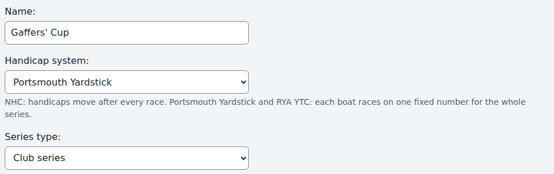
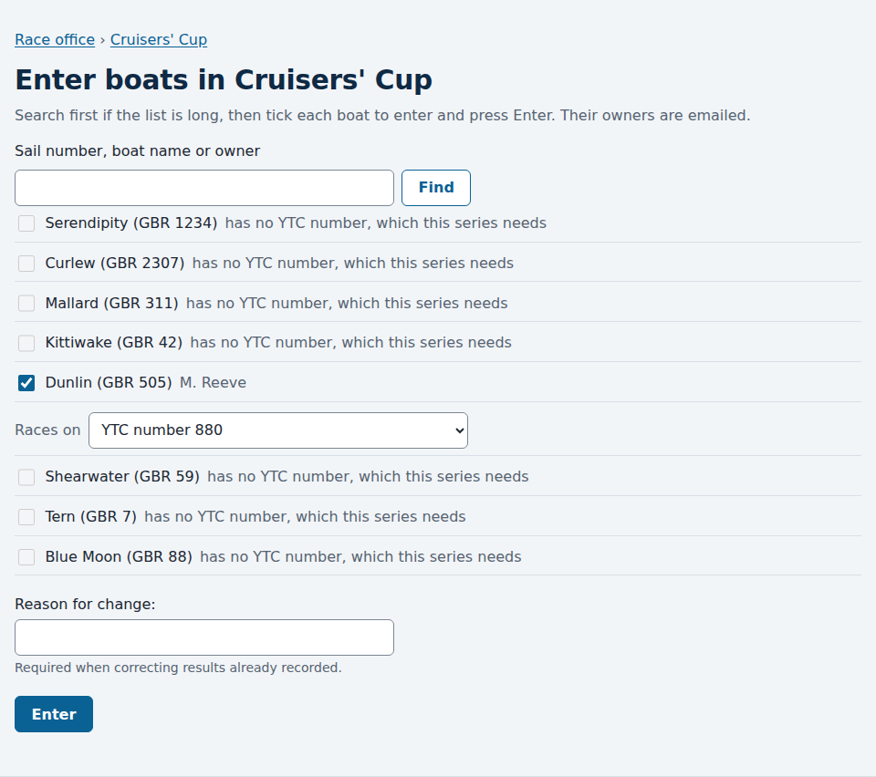
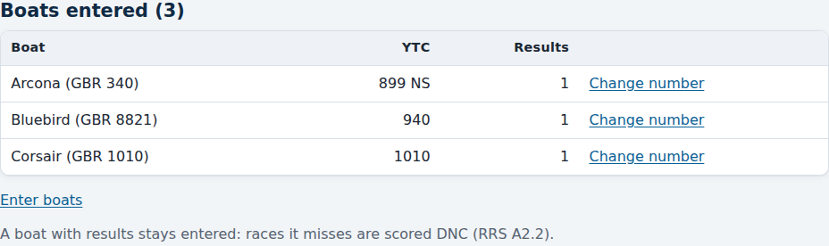
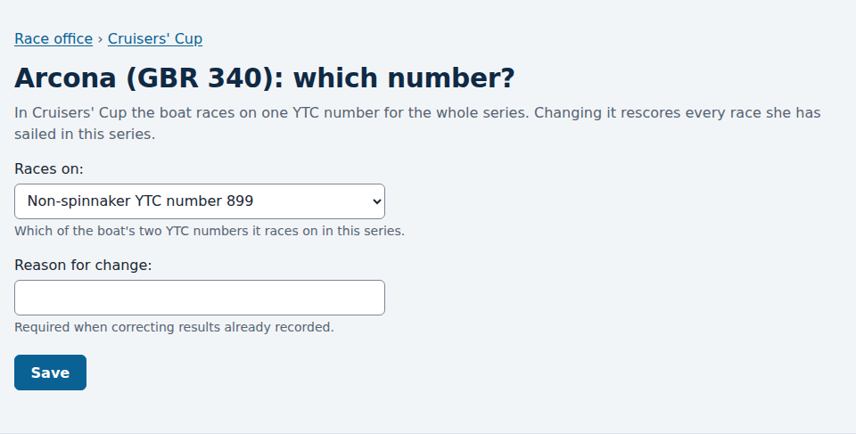
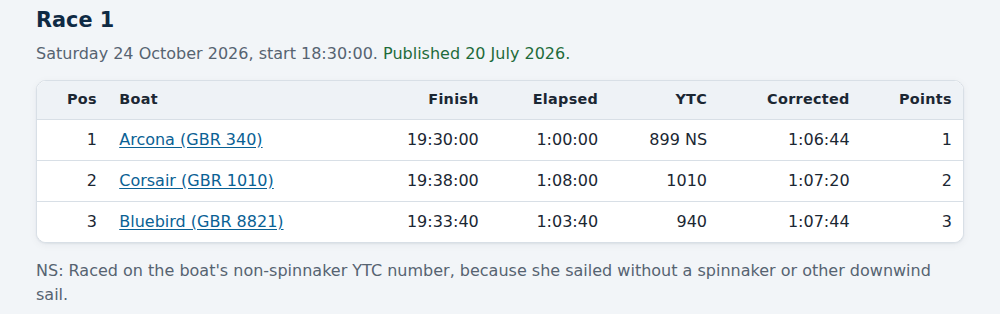
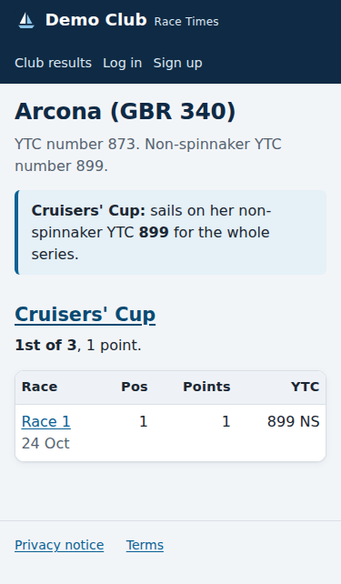
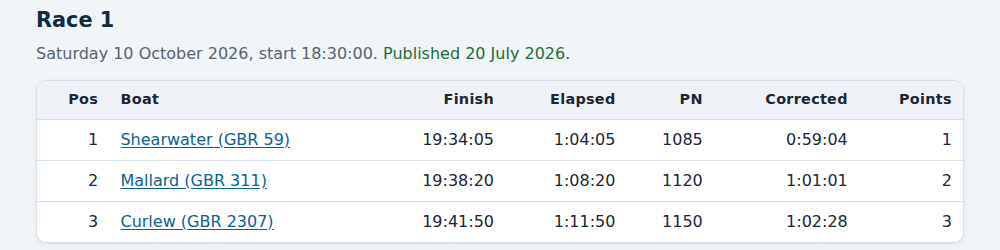
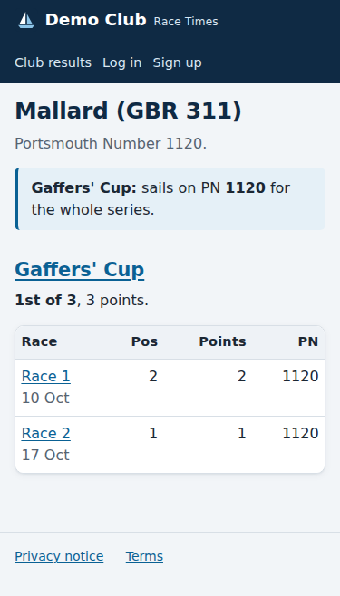

# Handicap systems: NHC, Portsmouth Yardstick and RYA YTC

*For the race committee and the administrator.*

Every series is scored with one **handicap system**. You choose it when you
start the series. Race Times offers three.

| System | What a boat sails on | Does it change? |
|---|---|---|
| **NHC** (National Handicap for Cruisers) | The boat's NHC base number, such as 0.964, which then moves after every race according to how she did. | Yes, after each race. |
| **Portsmouth Yardstick** (PY) | The boat's Portsmouth Number (PN), a whole number such as 1072. A higher number is a slower boat. | No. It is the same for every race of the series. |
| **RYA YTC** (Yacht Time Correction) | One of the boat's two YTC numbers, whole numbers such as 873 and 899. A higher number is a slower boat. | No. It is the same for every race of the series. |

With Portsmouth Yardstick or RYA YTC a boat's corrected time is her elapsed
time multiplied by 1000 and divided by her number. The lowest corrected time
wins.
Places, points, discards and the standings are worked out exactly as for NHC
(Appendix A of the Racing Rules of Sailing). Nothing is rounded before the
boats are ranked.

## Choosing the system

In the [race office](race-office.md), follow **New series** and choose the
system in the **Handicap system** box.

The choice is part of the series' [scoring rules](scoring-rules.md). Set it
before the first race. Once a series has results, changing the system is a
correction: it needs a reason and it's recorded in the series' history, like
any other rule.

Some settings only make sense under NHC: a regatta, a minimum number of
finishers, capping extreme results, and realigning to base handicaps. A
Portsmouth Yardstick or RYA YTC series refuses them, with a message saying so,
rather than quietly ignoring them. Discards, the discard threshold and RRS A5.3 work
for both.

## Boat numbers

Each boat can have an NHC base number, a Portsmouth Number and two YTC
numbers. See [Setting up boats](setting-up-boats.md). A boat must have the
number of every series she is entered in:

- To enter a boat in an NHC series she needs an NHC base number.
- To enter a boat in a Portsmouth Yardstick series she needs a Portsmouth
  Number.
- To enter a boat in an RYA YTC series she needs a YTC number, a
  non-spinnaker YTC number, or both. See below.

On the **Enter boats** page, a boat without the right number is listed but
can't be ticked, and says what she is missing.

A boat that races in several kinds of series can have all of them. A boat
needs at least one.

## RYA YTC: a boat's two numbers

A boat's RYA YTC certificate carries two numbers. The **YTC number** (873 on
the RYA's example certificate) is for racing with a spinnaker or other
downwind sail. The **non-spinnaker YTC number** (899 on the same certificate)
is for racing without one, so it is higher and the boat's corrected time is
lower. A club may also set its own numbers for its club racing; Race Times
only ever uses the numbers you type in, and doesn't work one out from the
other.

Both are optional, but a boat needs the one a series races her on.

### Choosing which number a boat races on

The choice is made when a boat is entered in an RYA YTC series, and it belongs
to that entry: for the whole series, not race by race. So the same boat can be
on her YTC number in one series and her non-spinnaker number in another.

- On **Enter boats** in an RYA YTC series, a boat with both numbers is asked
  which she races on, and starts on her YTC number. A boat with one number is
  entered on it. A boat with neither is listed but can't be ticked.
- A member's request to enter a series asks the same question; you see their
  answer on the Change requests page. If the boat has since lost that number,
  approving it is refused.
- To change it later, open the series in the race office and follow **Change
  number** beside the boat. Once the series has results this is a correction:
  it needs a reason, it's recorded in the series' history, and every race the
  boat sailed in the series is worked out again.

- When you switch an existing series to RYA YTC, each boat is put on her YTC
  number, or on her non-spinnaker number if that is the only one she has. It
  is refused, naming the boats, while any boat in the series has neither.
  Switching away resets the choice.

### How it shows

The results head the column **YTC**. A boat on her non-spinnaker number is
marked **NS**, with a line under the table saying what it means. The same
mark is on the race day page, in the results emails and in the CSV download,
so the committee on the water knows which boats shouldn't be flying a
spinnaker.

A boat's page says which number she sails on for the whole series.

## Changing a boat's number

Change it as you would a base number: open the boat in **The club's boats**
and change the number. Once the boat has results, changing a number she has
raced on is a correction. It needs a reason, it's recorded in the history of
every series that uses the number, and the results are worked out again with
the new number for the whole series.

A number a boat has never raced on can be changed freely, even if she has
raced on her other one. A number can't be removed while a series has the boat
racing on it.

Numbers are normally reviewed once a year, when a new certificate or list
replaces the old one. Race Times has no way to change a boat's number
part-way through a series so that earlier races keep the old one. If your
club revises numbers mid-season, start a new series.

### Temporary YTC numbers

The RYA's rules say a temporary YTC number, issued while a boat's real one is
worked out, shouldn't be altered and any results using it shouldn't be changed
afterwards. Race Times can't do that during a series: if a boat's temporary
number is replaced part-way through, her earlier races in that series are
worked out again on the new one. If your committee needs the earlier results
to stand, keep the temporary number until the series is
[declared final](ending-a-series.md), and change it afterwards. A final series
keeps the numbers its boats raced on.

## Running a Portsmouth fleet beside an NHC fleet

If part of your fleet races on PN and part on NHC, run them as two series
with the same races: one of each system, and enter each boat in the series
that suits her. Each series has its own results and its own standings.

## What the public sees

The series' results show a **PN** column in place of the NHC handicap, and no
"next handicap", since nothing changes.

A boat's page shows her PN for the series, her place and each race.

Declaring a series final keeps the numbers each boat raced on, so
[final results](ending-a-series.md) stay as they were even if a boat's number
is later changed.
