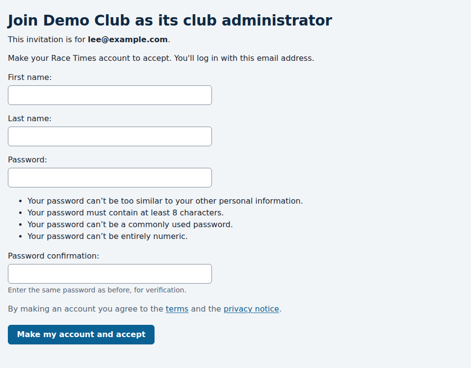
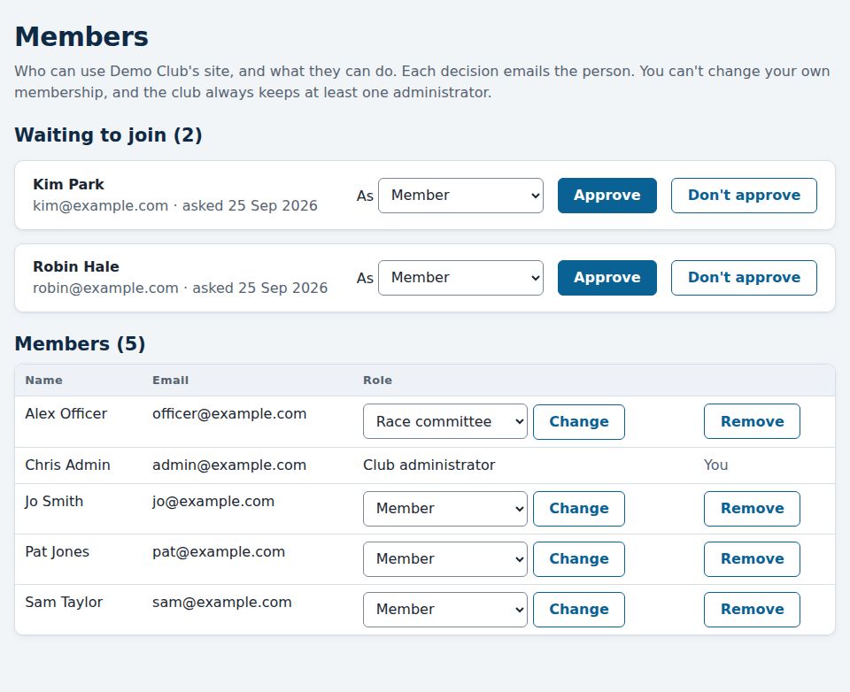

# Running your club: members and roles

*For club administrators.*

Everyone who uses your club's site has a **role** there:

| Role | Can |
|---|---|
| **Member** | Register their boats, ask for changes, ask to enter series, and see their requests. |
| **Race committee** | Everything a member can, and approve requests, set up boats, series and races, enter finishes and publish results. |
| **Club administrator** | Everything the race committee can, and manage the club's people on the **Members** page. |

A role belongs to the person *at your club*. Someone who also sails at
another club using Race Times has one login, and a separate role there that
the other club decides. Nothing they do there changes anything here.

## Becoming your club's first administrator

When your club starts using Race Times, its first administrator is invited by
email: **You're invited to run** your club **on Race Times**. Open the link
in it within 7 days. It goes to your club's own address.

- **If you don't have a Race Times login yet,** you make one there: your
  name and a password. Your email address is the one the invitation was sent
  to, and you're logged in straight away.
- **If you already have one,** from another club, log in with it, and press
  **Accept**.

Either way, you land on your club's **Members** page as its administrator.
The link works once. If it has expired, ask for a new invitation.

From then on the club runs itself: you approve people joining, and choose
who's on the race committee and who else is an administrator, as below.

## Approving people who want to join

Anyone can sign up at your club's address. They confirm their email address,
and then wait for you: until you approve them, they can see the club's
public results and nothing more. Someone who already has a Race Times login,
from another club, asks with **Join this club** instead.

The admin's front page tells you when people are waiting. Follow **Review
members**, or open **Members** at the top of any page.

For each person waiting:

1. Check you know them: their name and email address are shown.
2. Choose their role (usually **Member**).
3. Press **Approve**, or **Don't approve** if they shouldn't have access.

Either way, they're emailed straight away to say what you decided.

If your club has no administrator yet, or yours is away, the service's
operator can also approve or turn down people waiting, at your club's
request. Anyone the operator approved shows "Approved by the Race Times
operator" on the Members page.

## Changing someone's role

Under **Members**, choose the new role in their row and press **Change**. To
put someone on the race committee, choose **Race committee**. To make another
club administrator, choose **Club administrator**. They're emailed about the
change.

## Removing someone

Press **Remove** in their row. They lose access to the club's members' and
committee pages straight away, and are emailed. Their boats and results stay
as the club's records. Removed people are listed at the bottom of the page,
and can ask to join again, which puts them back under "Waiting to join".

## Two rules

- **You can't change your own role or remove yourself.** Ask another of the
  club's administrators.
- **The club always keeps at least one administrator.** Before your role can
  change, someone else must be made an administrator.

So that there's always someone to turn to, it's a good idea for a club to have
two administrators.

## Downloading the club's data

**Download everything the club holds (ZIP)**, at the top of the **Members**
page, gives you a ZIP file of spreadsheet (CSV) files:

| File | Holds |
|---|---|
| `boats.csv` | Every boat, with its owner. |
| `members.csv` | Everyone at the club: name, email, role and status. |
| `series.csv`, `series_entries.csv`, `races.csv` | Every series, the boats entered in it, and its races. |
| `start_sheets.csv`, `finishes.csv` | Who was racing, and every recorded finish time and code. |
| `results/` | Each series' standings and race results, the same file as its **Download (CSV)** link. |
| `boat_requests.csv`, `entry_requests.csv` | Members' requests, and what was decided. |
| `history.csv` | Every change to a result: who, when, and why. |

It holds members' names and email addresses, so keep it safe, and share it
only as your club's own data protection rules allow.

If your club stops using Race Times, the service's operator can take the same
download for you before the club's data is deleted.
