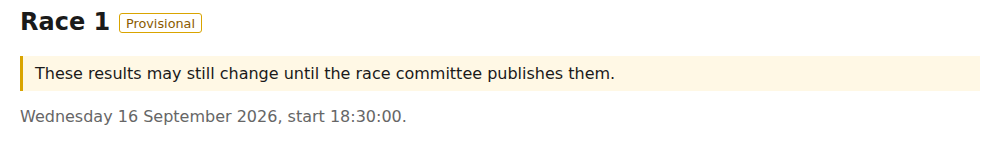
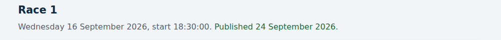
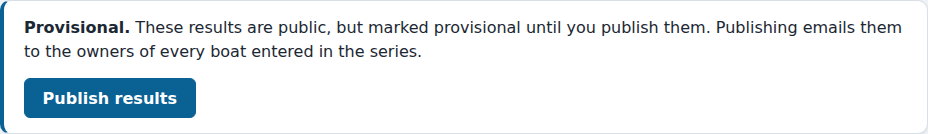
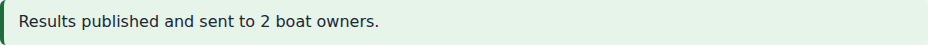
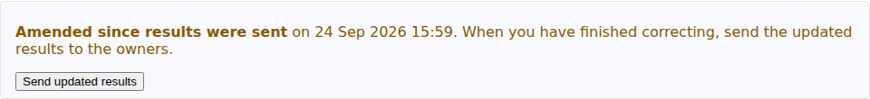
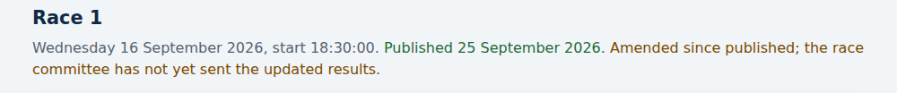

# Publishing results

*For the race committee and the administrator.*

Results appear on the public results page as soon as you save finish times,
so boat owners can see them straight away. Until you **publish** a race,
though, its results are marked **provisional**: they may still change while
you check the finish sheet.

Publishing does two things: it replaces the "Provisional" label with the date
the race was published, and it emails the race's results to the owner of
every boat entered in the series.

## Publishing a race

1. Open the race's finish-entry page: on the series' results page, press the
   race's button and then **Enter finishes** under its heading, or go from the
   series in the admin.
2. Check every boat's result. Every boat on the race's
   [start sheet](race-day.md) needs a finish time or a code first; until
   then, the box at the top lists the boats still to record instead of the
   button.
3. Press **Publish results** in the box at the top of the page.

The page then tells you how many boat owners were emailed:

Who gets the email:

- The owner of each boat entered in the series, if they have an approved
  account. Each owner gets their own email, so nobody sees anyone else's
  address, and an owner with two boats in the series gets one email.
- Boats with no owner on the site, such as visitors, get nothing.

A race with no results recorded yet cannot be published: there is nothing to
send.

If a boat is added to the start sheet after the race is published, for
example because it was missed on the night, updated results cannot be sent
until its finish is recorded. Recording it marks the race as amended, as
below.

## Correcting results after publishing

You can still correct a published race: a finish time, a code, the start
time, or anything else. Nobody is emailed while you do. Instead, the
publishing box tells you the results have changed since they were sent:

Until you send them, the public results page also warns that the results have
changed since they were published, so anyone comparing them with their email
knows which is current:

When you have finished correcting, press **Send updated results**. The warning
then goes, and the race shows the usual "Amended" note with the date it was
corrected. Everyone who
got the results before gets them again, as they now stand, marked "Updated
results". If you are still correcting, wait: nothing is sent until you press
the button.

A race counts as amended when anything changes that could move its results:

- a correction to this race;
- a correction to an **earlier** race in the series, because every later race
  is sailed on the handicaps the earlier ones produce;
- a change to the whole series, such as its discards, an entry, or a boat's
  NHC base number.

A change to a later race never amends an earlier one.

## If the emails could not be sent

If the site cannot send the emails, for example because the mail service is
down, it tells you, and nothing is lost: the race is still published, and the
publishing box offers a **Send results** button to try again later.
