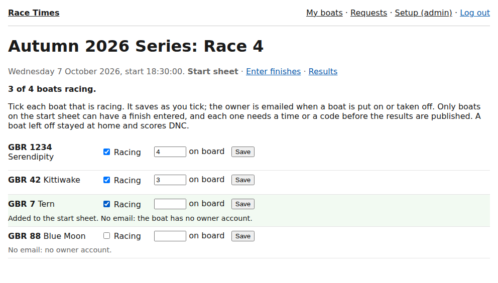
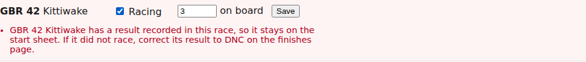
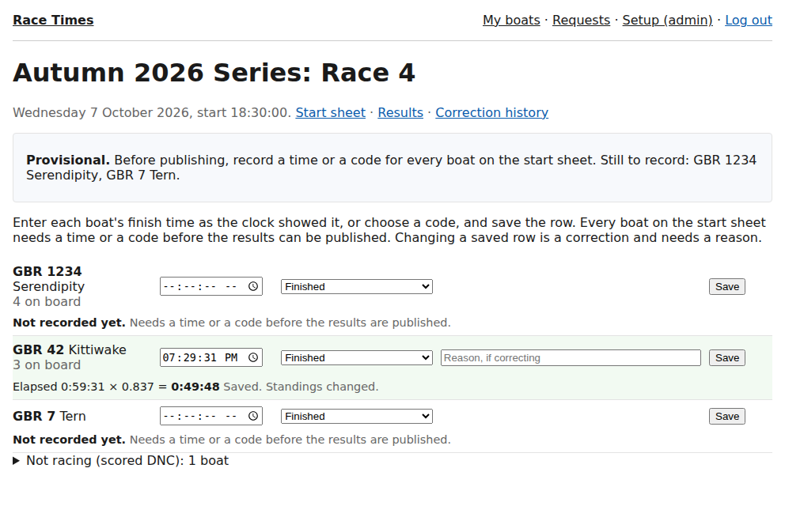

# Race day: the start sheet and finishes

*For the race committee and the administrator.*

Every race has a **start sheet**: the list of boats in the series that are
racing that day. You tick them on the start sheet, then record a finish time
or a code for each of them. A boat you leave off stayed at home, and is
scored DNC (did not come to the start) as usual.

## The start sheet

Open it from the race's finish-entry page (**Start sheet**, at the top), or
from the series in the admin, where each race has a **Start sheet** link.

Every boat entered in the series is listed. Tick **Racing** for each boat
that is racing. It saves as soon as you tick it: the row turns green, and the
count at the top goes up. You can also record how many people are on board.
That is optional, only the race committee sees it, and it does not affect
scoring.

The boat's owner is emailed when you put it on the start sheet, and again if
you take it off. Boats with no owner account on the site, such as visitors,
get no email. Their row says **No email: no owner account**, so you know to
tell them yourself. Changing the persons on board sends nothing.

You can add a boat at any time, even after the race. If a boat raced but was
missed off, add it on the start sheet, then record its finish.

### Taking a boat off

Untick **Racing**. Once a boat has a finish time or a code recorded in the
race, it cannot be taken off. If it did not race after all, correct its
result to **DNC** on the finish-entry page instead, giving a reason. It then
scores exactly as a boat left off the start sheet does.

## Entering finishes

The finish-entry page has a row for each boat on the start sheet, with the
persons on board under its name. Boats that are not racing are listed at the
bottom under **Not racing (scored DNC)**. Open that list to see which boats
they are.

Enter each boat's finish time as the clock showed it, or choose a code, and
save the row. A boat with nothing saved yet says **Not recorded yet**.

Until every boat on the start sheet has a time or a code:

- the race cannot be published, and updated results cannot be sent. The box
  at the top lists the boats still to record;
- on the results pages, those boats show as **NR** (not recorded), with a
  note under the table. For scoring, they are treated as DNC until you
  record them.

When every boat is recorded, you can
[publish the results](publishing-results.md).
