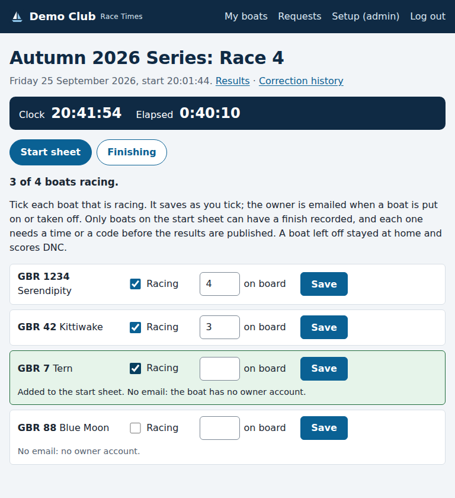
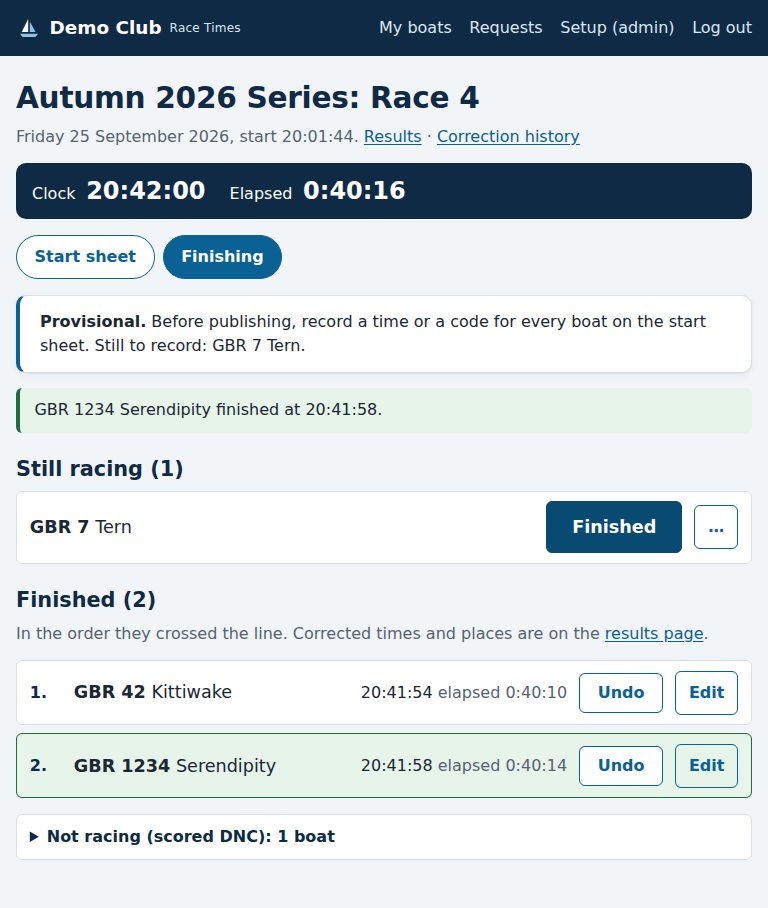
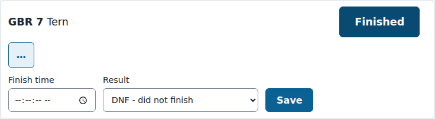

# Race day: the start sheet and finishes

*For the race committee and the administrator.*

Each race has a **race day page**. It works well on a tablet or phone at the
line, as well as on a computer. It has two views:

- **Start sheet**: tick the boats in the series that are racing that day.
- **Finishing**: tap **Finished** as each boat crosses the line, then
  publish the results.

A boat you leave off the start sheet stayed at home, and is scored DNC (did
not come to the start) as usual.

To open the page, go to the series' results page, press the race's button,
then **Race day page** under its heading. You can also go from the series in
the admin, where each race has a **Race day page** link. Switch between the
two views with the **Start sheet** and **Finishing** buttons at the top.

## The start sheet

Every boat entered in the series is listed. Tick **Racing** for each boat
that is racing. It saves as soon as you tick it: the row turns green, and the
count at the top goes up. You can also record how many people are on board.
That is optional, only the race committee sees it, and it does not affect
scoring.

The boat's owner is emailed when you put it on the start sheet, and again if
you take it off. Boats with no owner account on the site, such as visitors,
get no email. Their row says **No email: no owner account**, so you know to
tell them yourself. Changing the persons on board sends nothing.

You can add a boat at any time, even after the race. If a boat raced but was
missed off, add it on the start sheet, then record its finish.

### Taking a boat off

Untick **Racing**. Once a boat has a finish time or a code recorded in the
race, it cannot be taken off. If it did not race after all, correct its
result to **DNC** in the Finishing view instead, giving a reason. It then
scores exactly as a boat left off the start sheet does.

## Finishing

On the day of the race, the **clock** and the time **elapsed** since the
start are at the top. They aren't shown on any other day. Below them are two
lists:

- **Still racing**: every boat on the start sheet with nothing recorded yet,
  in sail-number order, so the rows don't move while you aim at them.
- **Finished**: every boat with a time, in the order it crossed the line,
  then any boats with a code.

### Tapping Finished

As a boat crosses the line, tap its **Finished** button. The time is
recorded to the second, and the boat moves to Finished straight away,
showing its time. Check the time: you can correct it at once with **Edit**.

The **Finished** button only appears on the day of the race, from its start
time. On any other day, for example when you enter results afterwards from a
paper sheet, type each time instead (see below).

**Check the clock before the first boat finishes.** A tap records the time
by the site's clock, which is the clock at the top of the page. It is set
from the internet and is accurate, but the race officer's watch may not
agree with it. If they differ by more than a second or two, type the times
from the watch instead, so every boat is timed by the same clock as the
start.

### Undo

Tapped the wrong boat? Press **Undo** on its row, and it goes back to Still
racing. Undo needs no reason, but it is only there for **two minutes**
after a finish is saved, and only before the results are published. After
that, correct the finish with **Edit** and give a reason. Both the finish and
the undo are kept in the race's correction history.

### Typing a time or a code

Every boat still racing has a **…** button, and every finished boat has
**Edit**. Either one opens a small form. Type the finish time as the clock
showed it, or choose a code (DNF, DNS or DNC), and press **Save**. Changing a
saved finish is a correction and needs a reason.

### Two devices at once

If two of the committee have the page open, for example one on the line
and one at the desk, each sees the other's finishes within about five
seconds. The page doesn't refresh while you have a **…** or **Edit** form
open, so it never wipes what you are typing.

### Before publishing

Boats that are not racing are listed at the bottom under **Not racing
(scored DNC)**. Open that list to see which boats they are.

Until every boat on the start sheet has a time or a code:

- the race cannot be published, and updated results cannot be sent. The box
  at the top lists the boats still to record;
- on the results pages, those boats show as **NR** (not recorded), with a
  note under the table. For scoring, they are treated as DNC until you
  record them.

When every boat is recorded, you can
[publish the results](publishing-results.md).
