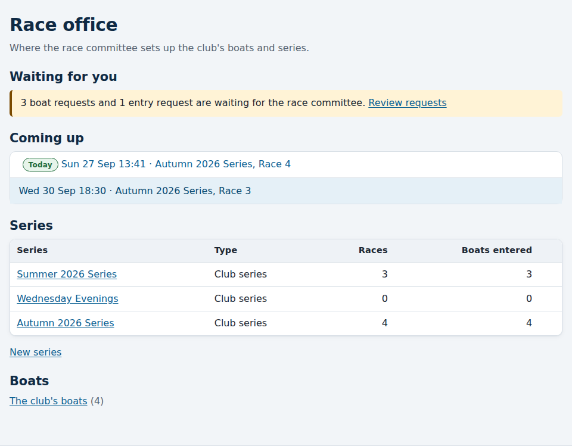
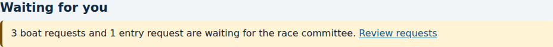

# The race office

*For the race committee and the administrator.*

The **race office** is where the race committee sets up the club: its boats,
its series and their scoring rules, the races in each series, and which boats
are entered. It is also the quickest way onto the water on race night. Open
it from **Race office** at the top of any page.

## Waiting for you

At the top, the race office tells you if anything is waiting for you, with a
link straight to it. You only see what you can act on:

| Notice | Who sees it | The link takes you to |
|---|---|---|
| Boat and entry requests waiting for the race committee | The race committee and club administrators | The **Change requests** page |
| People waiting to join the club | Club administrators only | The **Club members** page |

If nothing is waiting, it says "Nothing waiting." See
[Reviewing waiting requests](reviewing-requests.md) for what to do next.

## Coming up

The next five races from today, across every series that isn't final,
soonest first. Today's races are marked **Today**. Each one opens its
[race day page](race-day.md), ready for the start sheet and finishes.

A race only appears here once it is in a series: see
[Setting up a series](setting-up-a-series.md).

## Series

Every series, open ones first (newest first), then the ones whose results are
final. Each row shows how many races it has and how many boats are entered.
Choose a series to set it up, or **New series** to start one. See
[Setting up a series](setting-up-a-series.md).

## Boats

A link to the club's boats, with how many there are. See
[Setting up boats](setting-up-boats.md).
