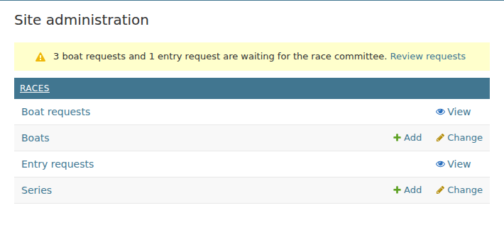
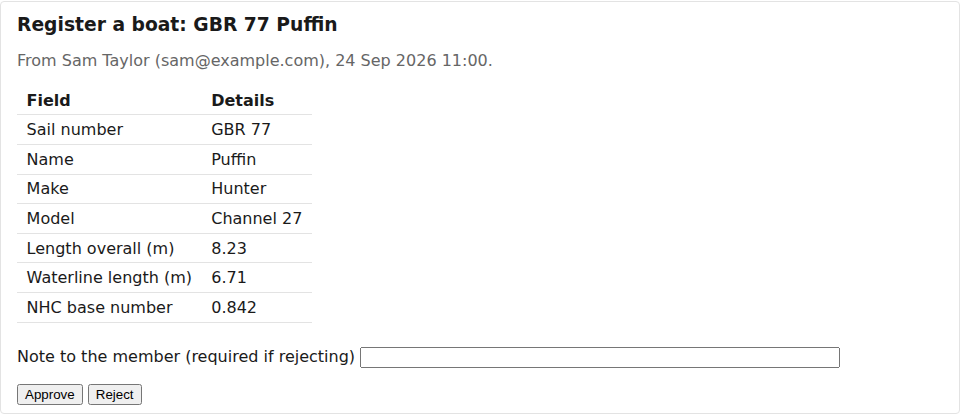
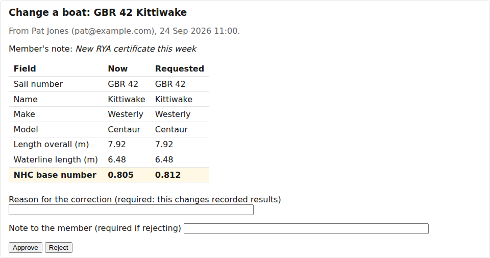
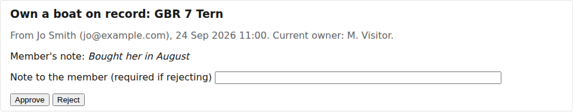
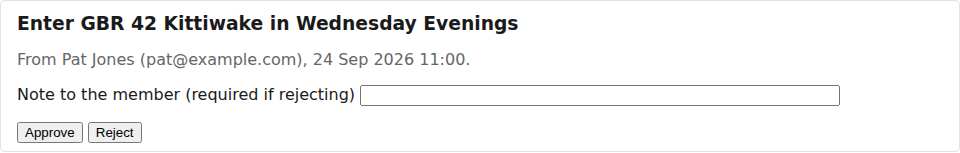
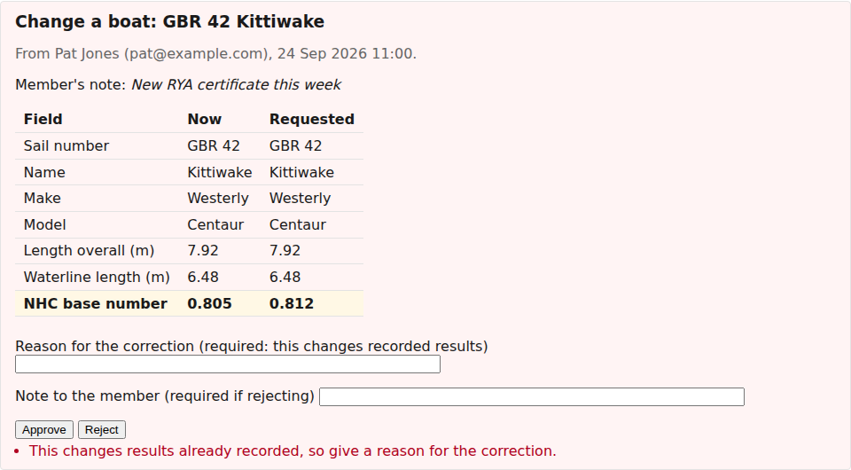
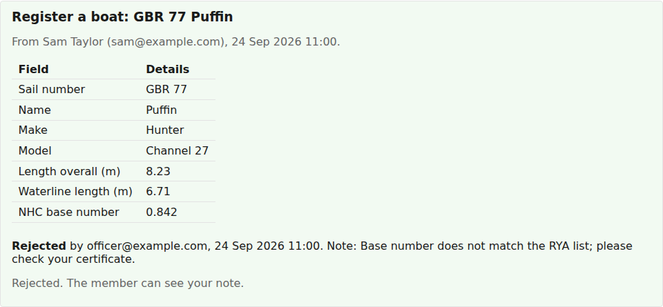
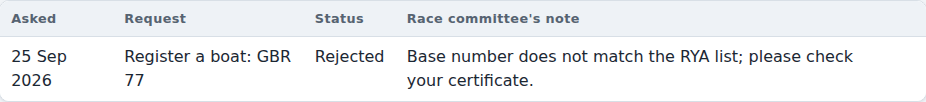
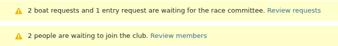
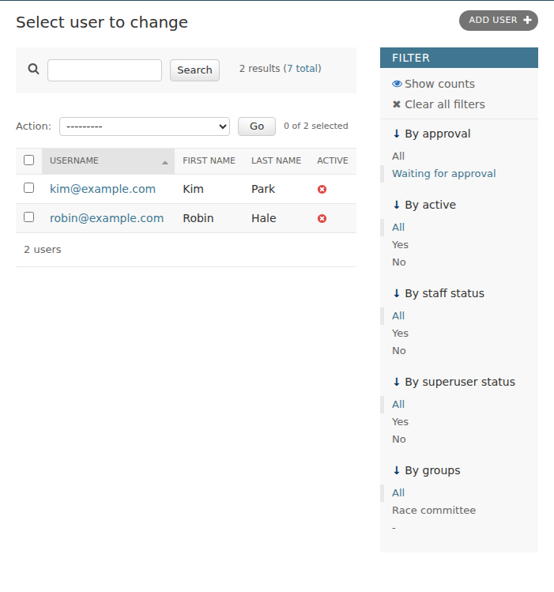

# Reviewing waiting requests

*For the race committee and the administrator.*

Members ask the race committee for things rather than changing them
themselves: registering a boat, changing one, being recorded as a boat's
owner, or entering a series. Each of these is a **request**, and it waits
until someone on the committee approves or rejects it. New members also wait,
until the administrator approves their account.

This page explains how you find out something is waiting, and how to deal
with it.

## Finding out what is waiting

Log in and open **Setup (admin)** from the top of any page. If anything is
waiting for you, the admin's front page says so at the top, with a link
straight to it:

You only see what you can act on:

| Notice | Who sees it | The link takes you to |
|---|---|---|
| Boat and entry requests waiting for the race committee | The race committee and the administrator | The **Requests** page |
| New accounts waiting for approval | The administrator only | The list of new accounts |

If nothing is waiting, there is no notice. You can also open the Requests
page at any time from **Requests** at the top of the site.

## The Requests page

The Requests page lists every waiting request, oldest first, so they can be
dealt with in the order members asked. Below them are the requests decided
most recently.

Each request shows who asked, when, any note they left for you, and what they
are asking for.

### The four kinds of request

**Register a boat.** A member wants a boat added to the club's records. You
see all the details they entered. Check the NHC base number against their RYA
certificate or the RYA's published list before approving: it is used in every
result the boat sails.

When you approve it, the boat is added to the club's records with that member
as its owner.

**Change a boat.** A member wants details of one of their boats changed. You
see each detail as it is **now** and as **requested**, and anything that
would change is highlighted:

**Own a boat on record.** A member says a boat already on the club's records
is theirs, for example because they have bought it. You see who is recorded
as the owner now. When you approve it, the member becomes the boat's owner;
nothing else about the boat changes.

**Enter a series.** A member wants to enter one of their boats in a series.
When you approve it, the boat is entered in the series, and is scored in every
race of it from then on.

### Approving a request

Press **Approve**. The change is made straight away, exactly as the member
asked, and the request shows who approved it and when. The member is emailed
to say it was approved, with what changed, and sees it on their boats page too.

Anything that affects results, such as a new NHC base number or a new entry
in a series, is also recorded in the series' change history under your name.

### When approving asks for a reason

Some approvals change results that are already recorded. For example, a new
base number for a boat that has already raced in a series changes that boat's
corrected times, and so possibly the places and handicaps of every boat in the
series. Entering a boat in a series that has already had a race changes
everyone's points for races they did not finish.

Changes like these are **corrections**. For a correction, the request shows a
**Reason for the correction** box. Fill it in before you approve, for example
"New RYA certificate, dated 20 September". If you leave it empty, nothing is
changed and the request asks you for one:

The reason is kept with the change in the series' change history, so anyone
on the committee can see later why results moved. After the approval, the
request tells you which places, handicaps and standings changed.

### Rejecting a request

Type a **note to the member** explaining why, then press **Reject**. A note is
required: the member sees it, and it tells them what to do next.

The member is emailed the decision with your note, and sees both alongside
their request:

Nothing about the boat or the series changes. The member can send a new
request, for example with a corrected base number.

### If a request cannot be approved

Occasionally the site refuses an approval and says why. This happens when
something changed after the member asked. For example:

- **"This request has already been decided."** Someone else on the committee
  dealt with it first, or the member withdrew it. Nothing more to do.
- **"… is already registered with the club."** Another boat with the same sail
  number was added meanwhile. Reject the request with a note, or ask the
  member to claim that boat instead.
- **"This boat is already entered in the series."** Someone entered it in the
  admin already. Reject the request with a note saying so.

Nothing is changed when an approval is refused.

## New accounts (administrator)

When someone signs up, their account cannot be used until the administrator
approves it. Until then, if they try to log in they are told their account is
waiting for approval.

The admin's front page tells the administrator how many accounts are waiting:

Follow **Review and approve** to see just those accounts:

To approve them:

1. Tick the accounts you recognise as club members.
2. Choose **Approve selected accounts** from the **Action** list.
3. Press **Go**.

They can log in straight away, and each is emailed to say their account is approved.

To turn someone away, open their account and delete it.

The same list is available at any time from **Users** in the admin: choose
**Waiting for approval** under **By approval** on the right. It lists only
new accounts, not accounts that were switched off later.
