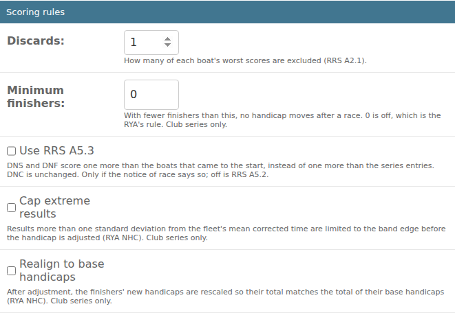

# A series' scoring rules

*For the race committee.*

Each series has its own scoring rules. Set them in **Setup (admin)**: open
**Series**, choose the series, and find the **Scoring rules** section. Set
them before the first race if you can. Once a series has results, changing a
rule asks for a reason, and the change is recorded in the series' history.

| Rule | What it does |
|---|---|
| **Discards** | How many of each boat's worst scores are left out of its total (RRS A2.1). |
| **Minimum finishers** | With fewer finishers than this in a race, nobody's handicap changes after it. 0 is off, which is the RYA's rule. Club series only. |
| **Use RRS A5.3** | Boats that did not start or did not finish score one more than the boats that came to the start, instead of one more than the series' entries. Only if your notice of race says so. |
| **Cap extreme results** | See below. Off unless your club uses it. Club series only. |
| **Realign to base handicaps** | See below. Off unless your club uses it. Club series only. |

## The two optional NHC steps

With both off, Race Times works out each boat's next handicap exactly as the
RYA's club-series rules describe. Some clubs publish results with a fuller
method, which adds one or both of these steps. Turn them on only if your club
scores that way, so your handicaps match the ones it publishes.

- **Cap extreme results.** Before the handicaps are adjusted, a boat whose
  corrected time is far from the rest of the fleet (more than one standard
  deviation from the average) is treated as if it had finished at the edge of
  that range. One unusually good or bad race then can't swing its handicap as
  far. It only affects the next handicap: the boat's times, place and points
  are exactly as recorded. It needs at least three finishers.
- **Realign to base handicaps.** After the handicaps are adjusted, the
  finishers' new handicaps are all scaled by the same small amount, so that
  together they add up to the same as those boats' base handicaps. This stops
  a fleet's handicaps drifting up or down together over a season.

Boats that don't finish keep their handicap either way, and play no part in
either step.

When either step is on, each race's results say so under the table, for
example "Handicaps adjusted with: extreme-result capping". With **More
detail**, a boat whose result was capped has a † next to its next handicap.
