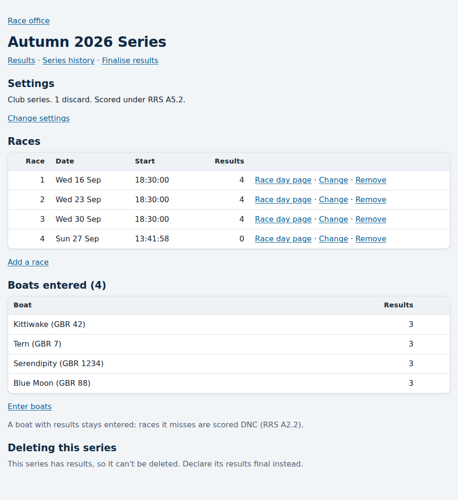
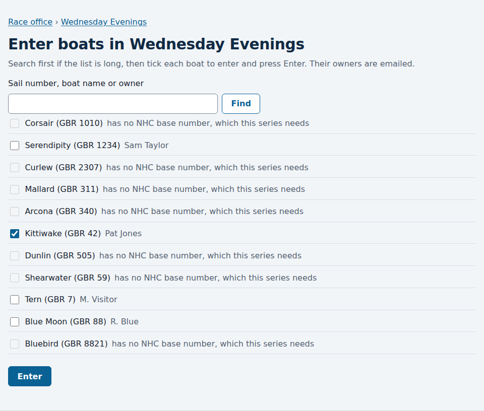

# Setting up a series

*For the race committee and the administrator.*

A **series** is a set of races scored together: say, the club's Wednesday
evenings for the autumn. Setting one up has three parts: its settings, its
races, and the boats entered in it. Do them in any order, and come back
whenever something changes.

## Starting a series

In the [race office](race-office.md), follow **New series**. Give it a name,
choose its [handicap system](handicap-systems.md) (NHC, Portsmouth
Yardstick or RYA YTC), choose whether it's a **club series** or a **regatta**, and set its
[scoring rules](scoring-rules.md). Press **Create the series** and you're
taken to the series' page.

## The series' page

Choose a series in the race office to open its page. It has everything about
the series in one place, and links to its public **Results**, its **Series
history** of changes, and **Finalise results**.

The public results page for the series has a **Set up this series** link back
here, for the race committee.

### Settings

A summary of the series' scoring rules. **Change settings** opens the same
form as when you started it. See [A series' scoring rules](scoring-rules.md).

### Races

Each race's number, date, start time and how many results it has, with its
**Race day page**.

- **Add a race**: the next number is filled in for you. Give the date and the
  start time. The race then appears under **Coming up** in the race office.
- **Change**: a race's number, date or start time. Races are scored in number
  order, not by date. A number already used in the series is refused, so to
  swap two races, move one to a spare number first.
- **Remove**: asks you to confirm. A race with results loses them.

Once a race has results, changing its number or start time, or removing it,
is a correction: the page asks for a reason, it's recorded in the series'
history, and afterwards the page says what it changed. A start time can't be
moved to or after a finish time already saved. Changing only the date moves
no score.

### Boats entered

Every boat entered, and how many results each has.

- **Enter boats** lists the club's boats not yet in the series. Tick each one
  to enter and press **Enter**. If the list is long, search first: the boats
  you've ticked stay ticked while you search. Each owner is emailed that their
  boat is entered. In an RYA YTC series, a boat with two YTC numbers is also
  asked which she races on (see [Handicap systems](handicap-systems.md)).

  

- **Remove** takes a boat out of the series, after you confirm, and emails its
  owner. A boat with results in the series can't be removed: a boat that has
  entered is scored for the whole series (RRS A2.2), and races it misses are
  scored DNC.

Once the series has results, entering or removing a boat changes how many
boats are scored, so it needs a reason, like any other correction.

A boat must be on the club's list before it can be entered, and must have the
number the series' [handicap system](handicap-systems.md) needs (an NHC base
number, a Portsmouth Number or a YTC number): see [Setting up boats](setting-up-boats.md).

## A final series

Once a series' results are [final](ending-a-series.md), it's locked. Its page
says so, and offers no way to change its races or entries. You can still
change its name. To change anything else, reopen its results first.

## Deleting a series

A series can be deleted only while no race in it has a result: at the bottom
of its page, follow **Delete this series** and confirm. Its races and entries
go with it, and the owners of the entered boats are emailed that their boat is
no longer entered. A series with results can't be deleted; declare its results
final instead.
