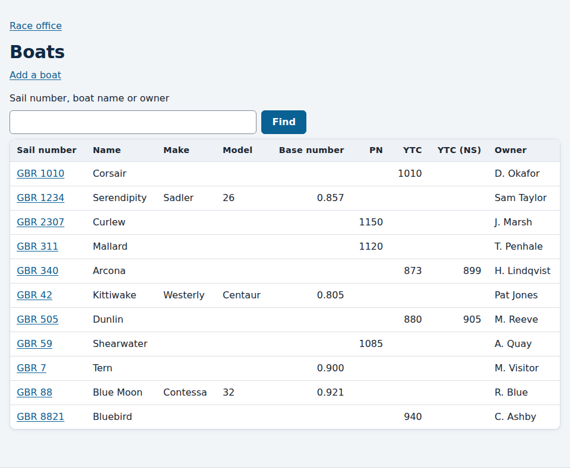
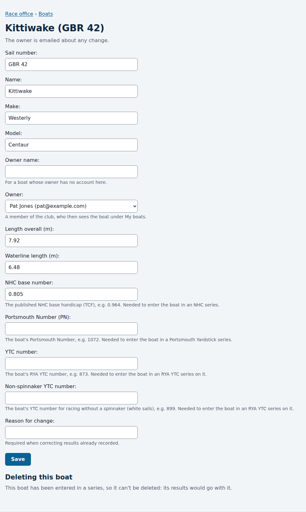

# Setting up boats

*For the race committee and the administrator.*

Every boat that races needs to be on the club's list first. Members can ask
for their own boat to be added (see [Reviewing waiting requests](reviewing-requests.md));
the race committee can add and change boats directly here.

## The club's boats

In the [race office](race-office.md), follow **The club's boats**. Every boat
is listed by sail number, with its name, make, model, NHC base number,
Portsmouth Number, YTC numbers and owner.

To find a boat, type part of its sail number, its name or its owner's name in
the search box. The list narrows as you type. Sail numbers match however
they're spaced or capitalised, so "gbr42" finds "GBR 42".

## Adding a boat

Follow **Add a boat**, fill in its details, and press **Add the boat**. Only
the sail number and at least one number (below) are required.

- **Sail number** must be unique at the club. "GBR 42" and "gbr42" count as
  the same.
- **Owner** is a member of the club. They then see the boat under **My boats**,
  and are emailed about changes to it. Only the club's approved members are
  offered.
- **Owner name** is for a boat whose owner has no account here, such as a
  visitor. It is shown instead, and nobody is emailed.
- **NHC base number** is the boat's published NHC base handicap, such as
  0.964. An NHC series starts each boat on it.
- **Portsmouth Number (PN)** is the boat's Portsmouth Yardstick number, such
  as 1072. A Portsmouth Yardstick series uses it for every race.
- **YTC number** and **Non-spinnaker YTC number** are the two numbers on the
  boat's RYA YTC certificate (or the club's own), such as 873 and 899. A series
  entry chooses which of them the boat races on.

A boat needs the number of every series she's entered in, so give her the
ones she'll use. See
[Handicap systems](handicap-systems.md).

## Changing a boat

Choose the boat's sail number in the list, change what you need, and press
**Save**. The owner is emailed what changed. If you change the owner, both
the old and the new owner are told.

Changing a boat's **NHC base number** changes the handicaps in every NHC series
it's entered in, and changing her **Portsmouth Number** changes the results in
every Portsmouth Yardstick series. A YTC number changes the series where a
boat is entered on that number. Once the boat has results, the page shows a **Reason for
change** box, and a new base number needs a reason: it is a correction, and
it's recorded in each series' history with your name and the reason. After
saving, the page says what the change moved in each series, such as
"Handicaps changed in races 1-3." Other details (the name, make, owner and
so on) move no score and need no reason.

A boat in a series whose results are [final](ending-a-series.md) can still be
changed. The final series keeps the results it was declared with.

## Deleting a boat

A boat that has never been entered in a series can be deleted: open it,
follow **Delete this boat**, and confirm. Any requests members made about it
go with it.

A boat that has been entered in a series can't be deleted, since its results
would go with it. Its page says so instead of offering the link.
