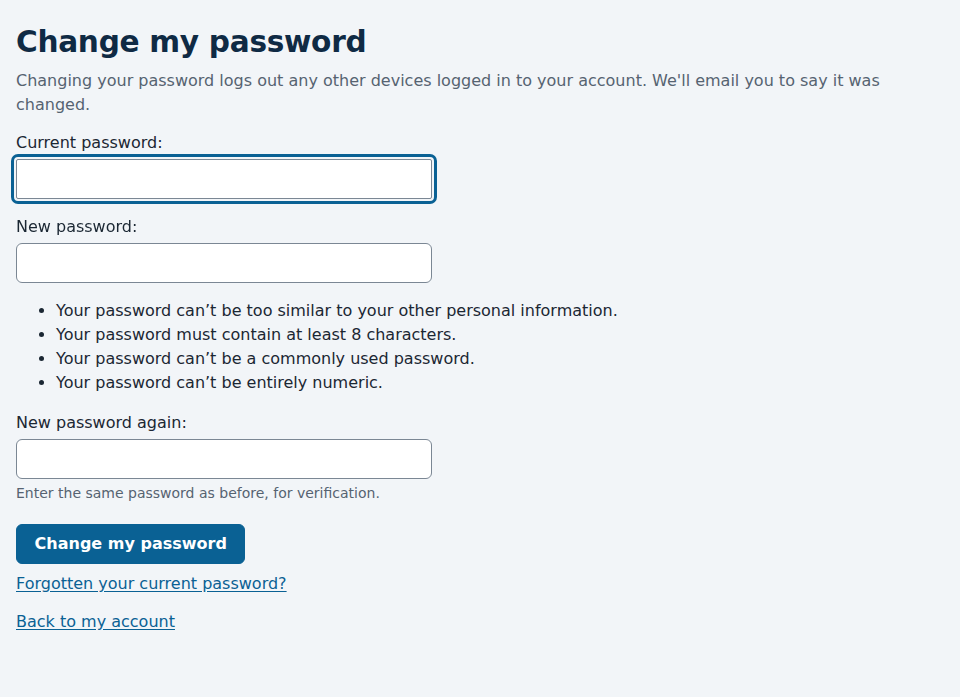

# Changing your password

*For everyone with an account.*

If you know your password and want a new one, change it from **My account**.
If you've forgotten it, see [Forgotten your password?](forgotten-password.md)
instead.

1. Open **My account** at the top of any page, and under **My password**
   choose **Change my password**.
2. Enter your current password, then your new password twice.
3. Press **Change my password**.

You stay logged in on the device you used, and go back to **My account**.

## Rules for a new password

The same as when you signed up:

- at least 8 characters;
- not too like your name or email address;
- not a common password;
- not all numbers.

## Other devices are logged out

Changing your password logs out any other phone, tablet or computer that was
logged in to your account. Log in again there with your new password. If
you're changing your password because someone else might know it, this stops
them straight away.

## The email you'll get

Race Times emails you, "Your Race Times password was changed", saying when
it happened. It never includes your password. If you didn't change it
yourself, reset your password straight away with the link in the email, then
reply to tell your club.

## "Too many failed logins"

Entering a wrong current password counts as a failed login. After 10 in a row,
changing your password, and logging in to your account, are paused for 15
minutes, even with the right password, so nobody at a computer you've left
logged in can guess it.
