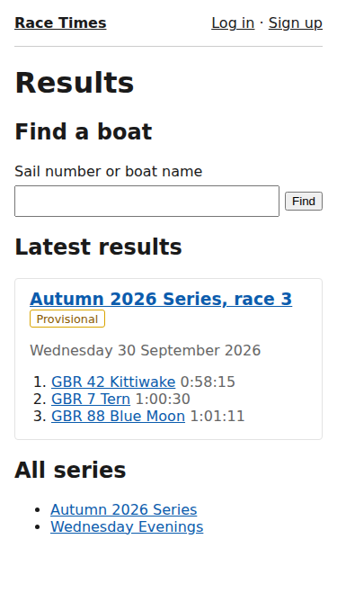
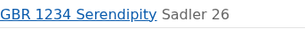
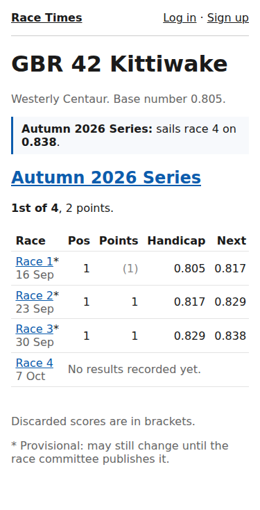
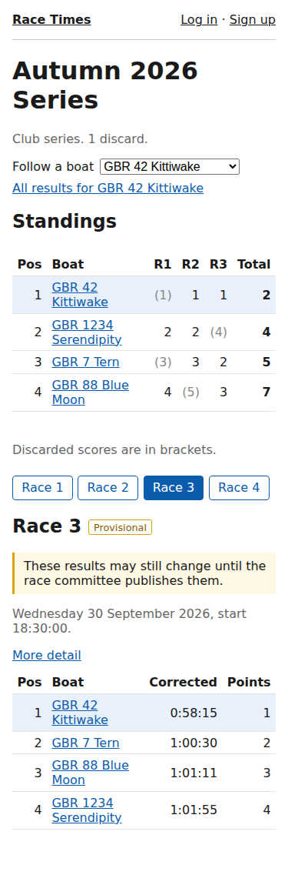

# Finding your results

*For everyone. You do not need an account to see results.*

The site's front page is the results page. It is built to be read on a
phone, so you can check how you did straight after the race.

## Finding your boat

Type your sail number or your boat's name in **Find a boat**. Matching boats
appear as you type. Spaces and capital letters in sail numbers do not matter:
"gbr1234" finds "GBR 1234".

Choose your boat to open its own page. It is worth bookmarking.

If you have an account and have logged in, your own boats are listed on the
front page under **My boats**, and on your **My boats** page each boat has a
**Results** link.

## Your boat's page

At the top, in the blue box, is the handicap your boat sails on in the next
race of each series it is entered in. It is worked out from every race sailed
so far, under the RYA's NHC rules. Before the first race of a series it is
your boat's base number.

Below that, for each series, newest first:

- where your boat stands in the series, and its points;
- each race: your place (or a code such as DNF), your points, your corrected
  time, the handicap you sailed on, and the handicap you took into the next
  race.

Points in brackets are **discarded**: your worst results, which the series'
rules leave out of your total. A race marked with an asterisk (\*) is
**provisional**: it may still change until the race committee publishes it.
On a phone the corrected times are left out to make room; they are on the
series' page.

## A series' results

Choose a series on the front page, or a series' name on your boat's page, to
see its standings and one race at a time. It opens on the latest race with
results; press a race's button to see another.

- **Follow a boat** highlights one boat in the standings and in every race you
  look at, so you can find it quickly in a big fleet.
- On a phone, each race shows place, boat, corrected time and points. Press
  **More detail** for the finish time, elapsed time, and the handicap each
  boat sailed on and takes into the next race.

Every page's address includes what you chose, such as the race and the boat
you are following, so you can bookmark it or send the link to your crew.

## Labels you may see

| Label | What it means |
|---|---|
| **Provisional** | The race committee has not published this race yet. Its results may still change while they check the finish sheet. |
| **Published** | The committee has checked and published the results, and emailed them to boat owners. |
| **Amended** | Something was corrected after the results first appeared, on the date shown. |
| **Amended since published** | A published race has been corrected, and the committee has not yet sent the updated results. The page shows the results as they now stand. |
