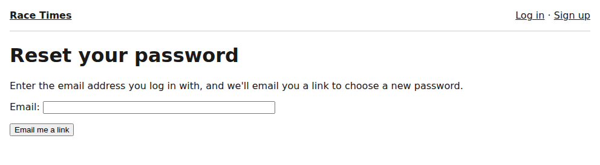

# Forgotten your password?

*For everyone with an account.*

1. On the **Log in** page, choose **Forgotten your password?**
2. Enter the email address you log in with, and press **Email me a link**.

   

3. Open the email "Reset your Race Times password" and follow its link.
4. Choose a new password, enter it twice, and save it. You can then log in
   with it.

The link works once, and only for a few days. If it has expired, ask for a
new one the same way.

The page always says it has sent a link, whether or not the address has an
account: that way it can't be used to find out who is a member. If no email
arrives, check your spam folder, then check you used the address you signed up
with. Accounts still waiting for the administrator's approval cannot reset
their password yet.
