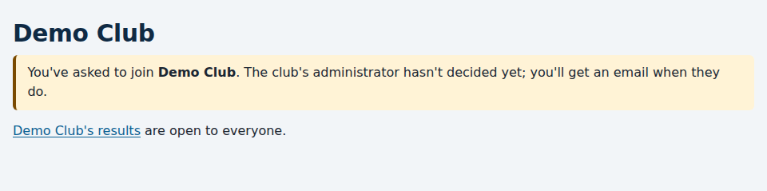

# Joining a club

*For anyone who sails at a club that uses Race Times.*

Anyone can see a club's results without an account. To register your boats,
enter series and hear about your results, you join the club.

## Signing up

1. Go to your club's Race Times address, e.g. `demo.racetimes.co.uk`, and
   choose **Sign up** at the top.
2. Give your name, email address and a password. Your email address is also
   how you'll log in.
3. We email you a link to **confirm your email address**. Open it within
   three days. Until you do, you can't log in.
4. Your club's administrator is asked to approve you joining. Until they do,
   you can log in, and the site tells you you're waiting.

When they decide, you're emailed. Once you're approved, **My boats** at the
top of the page is where you register your boats and enter series.

If the confirmation email doesn't arrive, check your spam folder. If you try
to log in before confirming, you're offered **Send the confirmation link
again**.

## Joining a second club

If you sail at another club that also uses Race Times, you don't need a new
account. Go to that club's address, log in with the same email and password,
and choose **Join this club**. That club's administrator approves you in the
same way.

Each club's site keeps its own login, so you log in at each club's address
separately. Your role is separate at each club too: being on the race
committee at one club gives you nothing at another.
