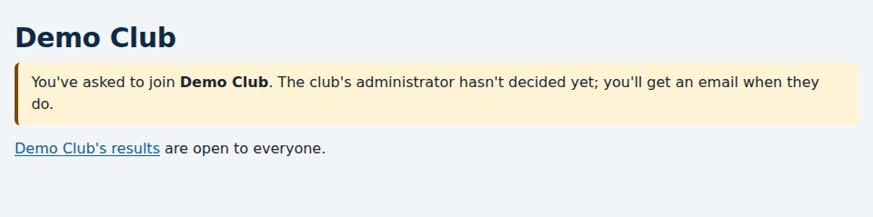
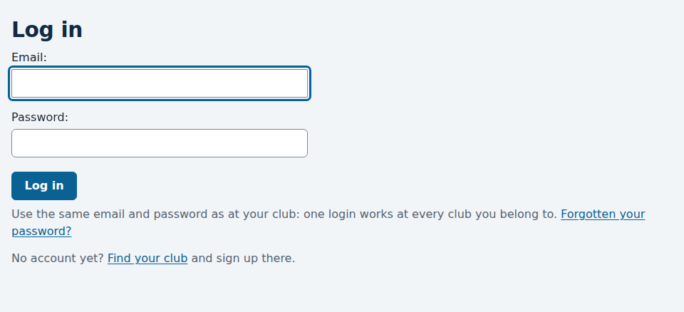
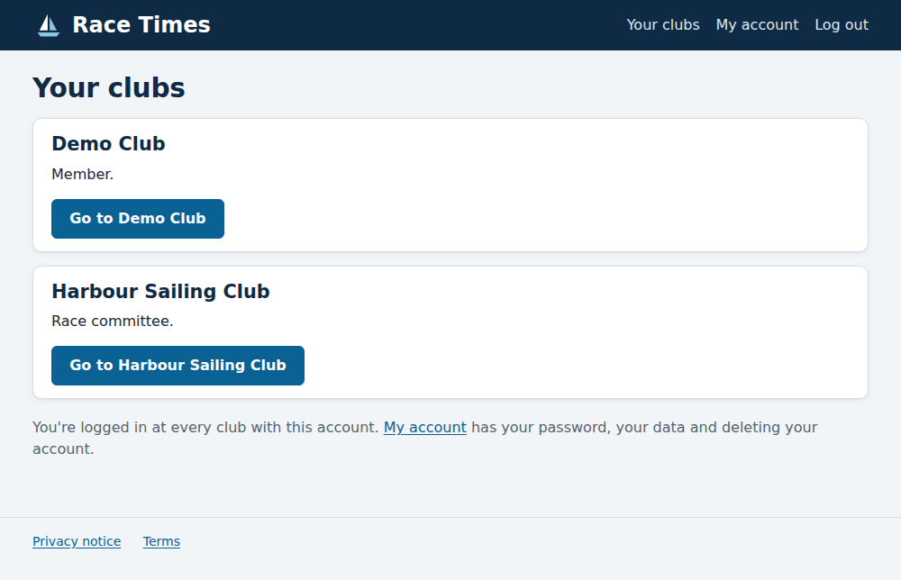
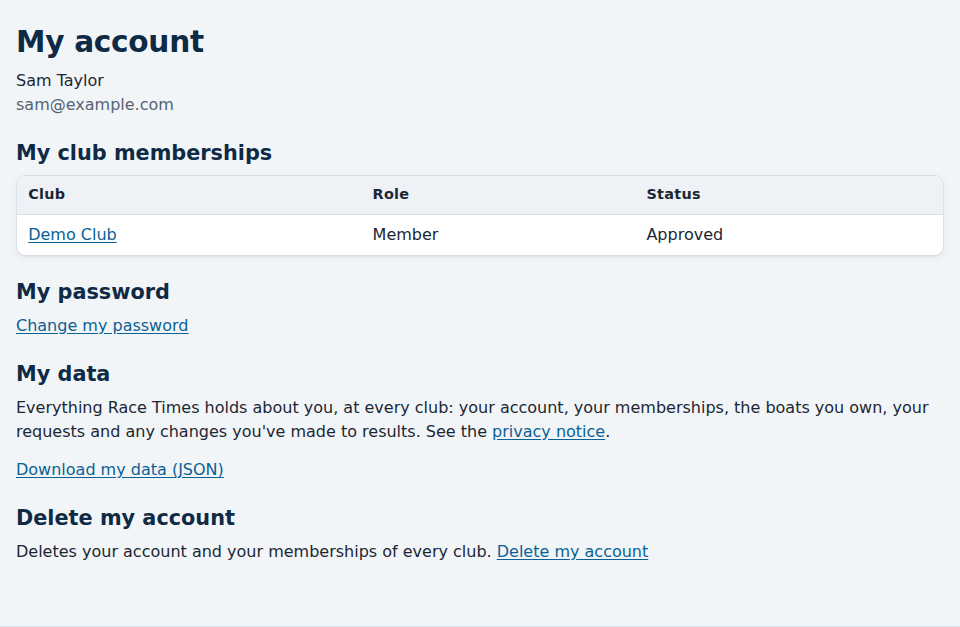
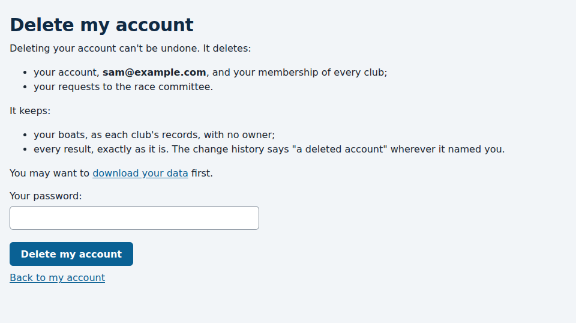

# Joining a club, and your data

*For anyone who sails at a club that uses Race Times.*

Anyone can see a club's results without an account. To register your boats,
enter series and hear about your results, you join the club.

## Signing up

1. Go to your club's Race Times address, e.g. `demo.racetimes.co.uk`, and
   choose **Sign up** at the top. If you don't know the address, type your
   club's name into **Find my club** at `racetimes.co.uk`.
2. Give your name, email address and a password. Your email address is also
   how you'll log in.
3. We email you a link to **confirm your email address**. Open it within
   three days. Until you do, you can't log in.
4. Your club's administrator is asked to approve you joining. Until they do,
   you can log in, and the site tells you you're waiting.

When they decide, you're emailed. Once you're approved, **My boats** at the
top of the page is where you register your boats and enter series.

If the confirmation email doesn't arrive, check your spam folder. If you try
to log in before confirming, you're offered **Send the confirmation link
again**.

## Logging in

Log in with your email address and password, either at your club's address
(**Log in** at the top of its pages) or at `racetimes.co.uk`. One login works
at every club: once you're logged in at one, you're logged in at all the
clubs you belong to, and **Log out** logs you out of them all.

At `racetimes.co.uk`, **Log in** is at the top of the page, and under
**Find my club**.

If you belong to one club, logging in there takes you straight to its **My
boats**. If you belong to more than one, or are still waiting to be approved,
you see **Your clubs**: each club with your role there, and a button to go to
it.

Signing up is still done at your club's address, because signing up asks to
join that club.

On a shared computer, such as one in the clubhouse, remember to log out when
you've finished: someone using it after you would be logged in at every club
you belong to.

## Joining a second club

If you sail at another club that also uses Race Times, you don't need a new
account. Go to that club's address, log in with the same email and password,
and choose **Join this club**. That club's administrator approves you in the
same way.

Your role is separate at each club: being on the race committee at one club
gives you nothing at another, even though you're logged in at both.

## Your account

**My account**, at the top of every page once you're logged in (at your club
or at `racetimes.co.uk`), shows your name
and email address, and your role at each club you've joined or asked to join.
Under **My password** you can [change your password](changing-your-password.md).

## Downloading your data

**Download my data**, on your My account page, gives you a file of everything
Race Times holds about you, at every club: your account, your memberships,
the boats you own, your requests to the race committee, and any changes
you've made to results. It's a JSON file, a plain text format that other
programs can read.

It doesn't include other people's details, such as who approved you.

## Deleting your account

**Delete my account**, on your My account page, deletes your account and your
membership of every club. You confirm with your password.

- **What goes:** your account, your memberships and your requests to the
  race committee.
- **What stays:** your boats, as each club's records with no owner, and every
  result, exactly as it is. The change history says "a deleted account"
  wherever it named you.

You're emailed once to confirm it, and that's the last email Race Times sends
to that address. It can't be undone: to use Race Times again, sign up afresh.

If you're the only administrator of a club, you can't delete your account
until you've made someone else an administrator there: a club always keeps
one.

How your data is used, and your rights, are in the **Privacy notice**, linked
at the bottom of every page of your club's site.
